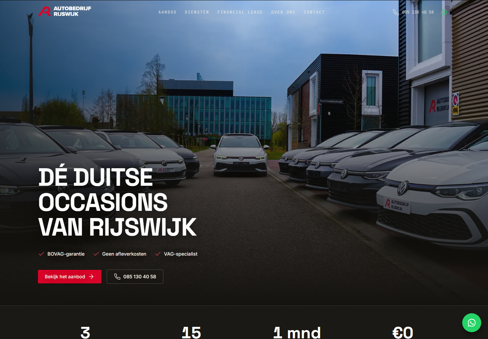

# Autobedrijf Rijswijk — Autogarage website

Een complete autogarage-website gebouwd met **Laravel 13**, **MySQL/MariaDB**, **Blade + Tailwind CSS** en **Alpine.js**. Met een publieke etalage (homepage, aanbod met live filtering, detailpagina met foto-carousel) en een beveiligde admin-omgeving (Laravel Breeze) voor volledig voorraadbeheer.

---

## 🚀 Live demo



> _Binnenkort online — hier komt een link naar een live demo._

---

## Functionaliteit

**Publiek**
- Homepage met uitgelichte en nieuwste occasions, echte Google-reviews (in eigen huisstijl) en vertrouwensband
- Aanbodpagina met **instant client-side filtering** (Alpine.js): zoeken, merk, brandstof, dual-range prijs- en bouwjaar-slider, sorteren, verwijderbare filter-chips, live resultatenteller en een mobiele filter-drawer
- Detailpagina met foto-carousel, alle specificaties, uitrusting/opties, vergelijkbare auto's en een **interesse-/aanvraagformulier** (met voorwerp, voorkeursdatum bij bezichtiging/proefrit, honeypot + rate-limiting)
- **Diensten**-pagina (inkoop, verkoop, aankoopbemiddeling, zoekopdracht)
- **Financial lease**-pagina met de externe FinancialLease-rekenwidget (maandbedrag-indicatie)
- **Contact**-pagina met formulier en Google Maps, plus `over-ons`, `volkswagen-specialist`, `privacybeleid` en `algemene-voorwaarden`
- Aanvragen worden opgeslagen én naar de zaak gemaild (`Reply-To` = klant)
- SEO: per-auto `Vehicle`- en site-brede `AutoDealer`-schema (JSON-LD), Open Graph, canonical, dynamische `sitemap.xml` + `robots.txt` en beveiligingsheaders (CSP e.a.)
- Volledig Nederlands: validatiemeldingen, e-mails, tijdzone (`Europe/Amsterdam`) en eigen foutpagina's (404, 413, 419, 429, 500, 503) met een weg terug
- WhatsApp-knop die op een detailpagina opent met een vooraf ingevuld bericht over díe auto
- Volledig responsive (mobiel / tablet / desktop) en toegankelijk (focus states, alt-teksten, skip-link, labels)

**Admin** (`/admin`, na inloggen)
- **Aanvragen-inbox** (`/admin/aanvragen`): open/afgehandeld, voorkeursdatum, auto, direct beantwoorden per mail of bellen; teller van open aanvragen in de navigatie
- Dashboard met voorraadoverzicht en statistieken
- Auto's toevoegen / bewerken / verwijderen (CRUD)
- Meerdere foto's uploaden per auto (ook grote telefoonfoto's: automatisch rechtgedraaid, verkleind tot max. 2000 px en als WebP opgeslagen), omslagfoto instellen, foto's verwijderen
- Waarschuwing vóór het versturen als foto's te groot zijn (limieten komen live uit de PHP-configuratie)
- Uitrusting/opties per auto aanvinken uit een bestaande lijst
- Snelle statuswijziging (beschikbaar / gereserveerd / verkocht)

---

## Vereisten

- **PHP 8.2 of hoger** (dit project is gebouwd op PHP 8.3)
- **Composer**
- **Node.js 18+** en npm
- **MySQL of MariaDB** (bv. via XAMPP)
- PHP-extensies `gd` en `exif`, en `upload_max_filesize` ≥ 16M / `post_max_size` ≥ 64M voor foto-uploads (zie [DEPLOY.md](DEPLOY.md))

> **Let op (XAMPP):** de PHP die met oudere XAMPP-versies meekomt kan te oud zijn (Laravel 13 vereist PHP 8.2+). Op deze machine draait een losse PHP 8.3 in `C:\php83`. Vervang in de commando's hieronder `php` desnoods door het volledige pad, bv. `C:\php83\php.exe`.

---

## Installatie

```bash
# 1. Dependencies installeren
composer install
npm install

# 2. Omgevingsbestand aanmaken en app-sleutel genereren
cp .env.example .env
php artisan key:generate

# 3. Database aanmaken (lege database met de naam 'garagesite')
#    Bijvoorbeeld via phpMyAdmin, of:
mysql -u root -e "CREATE DATABASE garagesite CHARACTER SET utf8mb4 COLLATE utf8mb4_unicode_ci;"
#    Controleer daarna de DB-gegevens in .env (standaard XAMPP: user root, geen wachtwoord)

# 4. Tabellen aanmaken en met voorbeelddata vullen
php artisan migrate --seed

# 5. Publieke opslag-snelkoppeling maken (voor geüploade foto's)
php artisan storage:link
```

> De seeder vult de demo met de **echte voorraad van Autobedrijf Rijswijk**: hij leest de openbare Marktplaats-listings van de dealer uit (`database/seeders/rijswijk_listings.json`), mapt de kenmerken naar onze velden en slaat de foto's lokaal op. Lukt het ophalen niet (bv. geen internet), dan valt die auto automatisch terug op nette, in-huisstijl SVG-placeholders — de seeder faalt nooit. `CarEnrichmentSeeder` vult daarna opties, extra specs en verkocht-status aan.

---

## Draaien

Start de front-end build (Vite) en de webserver in **twee terminals**:

```bash
# Terminal 1 — Vite (bouwt Tailwind/JS met hot reload)
npm run dev
```

```bash
# Terminal 2 — Laravel webserver
php artisan serve
```

Open vervolgens **http://localhost:8000**.

Voor een productie-build (dan is `npm run dev` niet nodig):

```bash
npm run build
php artisan serve
```

---

## Inloggen (admin)

Na `php artisan migrate --seed` bestaat er een beheerdersaccount:

| E-mail | Wachtwoord |
|--------|------------|
| `admin@autobedrijfrijswijk.test` | `password` |

Log in via **http://localhost:8000/login** en beheer de voorraad op **/admin**.
Publieke registratie is bewust uitgeschakeld — extra accounts maak je via de seeder of `php artisan tinker`.

---

## Structuur (kort)

```
app/
  Enums/CarStatus.php            # Statussen + labels/kleuren op één plek
  Models/                        # Car, CarImage, Lead, User (relaties, scopes)
  Http/Controllers/              # Publiek (Home, Car, Lead, Sitemap) + Admin\CarController, Admin\LeadController
  Http/Requests/                 # CarRequest + StoreLeadRequest (validatie)
  Http/Middleware/SecurityHeaders.php  # CSP en overige beveiligingsheaders
  Mail/LeadReceived.php          # Aanvraag-mail naar de zaak
  Support/DealerListing.php      # Parser voor de Marktplaats-listings
  Support/Reviews.php            # Google-reviews inlezen (config-gedreven)
  Support/PlaceholderImage.php   # SVG-vangnet voor foto's
  Support/ImageOptimizer.php     # Uploads rechtdraaien (EXIF), verkleinen, WebP
config/brand.php                 # Één bron voor contact, reviews, lease-feed, huisstijl
lang/nl/, lang/nl.json           # Nederlandse validatie-, login- en profielteksten
database/
  migrations/                    # cars, car_images, leads (+ options, preferred_date)
  seeders/CarSeeder.php          # ~85 echte occasions van de dealer + foto's
  seeders/CarEnrichmentSeeder.php# Opties, extra specs, verkocht-status
resources/views/
  components/                    # car-card, status-badge, icon (Lucide), lead-form, layouts, brand-mark
  home.blade.php, cars/          # Publieke etalage
  pages/                         # diensten, financial-lease, contact, over-ons, vw-specialist, privacy, voorwaarden
  admin/cars/, admin/leads/      # Voorraad + formulieren, aanvragen-inbox
  errors/                        # Nederlandse foutpagina's (404, 413, 419, 429, 500, 503)
```

## Ontwerpkeuzes

- **Signatuur:** donker "automotive-premium" thema (obsidiaan + het rode merk-accent `#D90429` van de dealer), scherpe hoeken met hairline-scheidingen i.p.v. overal identieke cards. De `brass`-token in `tailwind.config.js` houdt om historische redenen de rode waarden (naam is legacy).
- **Typografie:** Space Grotesk (display) + Inter (tekst) + JetBrains Mono (technische spec-labels).
- **Iconen:** één consistente [Lucide](https://lucide.dev)-set via een eigen `<x-icon>`-component (geen emoji).
- Kleuren en fonts staan als tokens in `tailwind.config.js` — pas ze daar aan om de hele huisstijl te wijzigen.

---

## Licentie

Uitgebracht onder de [MIT-licentie](LICENSE).

Gemaakt door **Safouane Lahoua** — [github.com/safouane070](https://github.com/safouane070)
